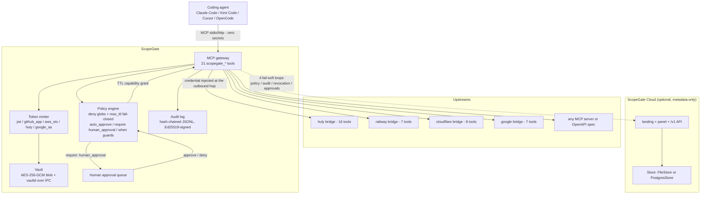

# ScopeGate Architecture

> Verified against the code on 2026-08-03 (`master` @ `9422a41`, npm
> `scopegate@0.2.1`). This document describes what the code does **today**.
> For the agent-facing usage protocol see [SKILL.md](SKILL.md) and
> [docs/agents/](docs/agents/README.md); for the cross-repo view see
> [docs/ecosistema.md](docs/ecosistema.md).

ScopeGate is an **ephemeral-credentials MCP gateway for coding agents**
(Claude Code, Kimi Code, Cursor, OpenCode). The agent never holds secrets —
it holds short-lived, minimum-scope **capabilities** minted by a policy
engine. Secrets live in an AES-256-GCM encrypted local vault and are
injected only at the outbound hop toward the upstream service.

## Components

### Vault (`src/vault/`)

- Single AES-256-GCM encrypted blob (`vault.enc`), atomic writes, mode
  `0600`. Key derived via scrypt from a master key.
- Master key backends: `file`, `dpapi` (Windows), `keychain` (macOS),
  `secret-service` (Linux); selected with `SCOPEGATE_MASTER_KEY_BACKEND`.
  `scopegate vault rotate-key` re-encrypts with backup/rollback (`kid` is
  auditable).
- `vaultd` runs the vault as an isolated process over a unix socket /
  Windows named pipe with transparent failover
  (`SCOPEGATE_VAULT_MODE=auto|local|daemon`).
- Config (`scopegate.yaml`, `policies.yaml`) **never** contains secrets —
  only `secretRef` names.

### Policy engine (`src/policy/`)

- Capabilities are `<upstream>:<action>:<resource>` triples.
- Rules: `auto_approve`, `require: human_approval`, TTL, `redact: [pii]`,
  and `when:` argument guards (e.g. auto-approve only on `kimi/*` branches).
- **Hard limits are fail-closed**: `deny` globs and `max_ttl` are evaluated
  before any rule and cannot be overridden.
- Persistent grants, task leases (long tasks, double budget), a human
  approval queue, hot-reload with last-good, and agent policy proposals
  landing in `policies.pending.yaml` (**write asymmetry**: agents propose,
  humans approve — proposals never touch live policy).
- When enrolled in ScopeGate Cloud, the signed team policy is applied as a
  restrictive intersection with local policy.

### Token minter (`src/minter/`)

Turns long-lived vault secrets into short-lived credentials. Providers:

| Provider | Mechanism | Typical TTL |
|---|---|---|
| `jwt` | Gateway-minted HS256 | per policy |
| `github_app` | App JWT (RS256) → installation token | ~1 h |
| `aws_sts` | AssumeRole / GetSessionToken | provider ceiling |
| `huly` | `login → selectWorkspace` against the account service (default `https://huly2.nexgen.systems`, discovered via `/config.json`) | workspace token |
| `google_sa` | SA JWT (RS256) → access token | ~1 h |

TTL = min(provider ceiling, grant TTL). Tokens are cached in memory only,
renewed at 80% of TTL, single-flight. `bearer` / `env` / `oauth2` fall back
to pure injection at the outbound hop.

### Audit (`src/audit/`)

- `audit.jsonl`: append-only, **hash-chained**, every event **signed
  Ed25519** (local identity in `~/.scopegate/identity.json`, stable sha256
  fingerprint).
- Inputs are hashed, never stored. The kinds taxonomy (`AUDIT_KINDS`) is
  frozen by contract (append-only).
- Segment rotation preserves the chain; `scopegate audit verify` checks
  sequence + chain + signatures and exits 1 on tamper.

### Gateway MCP server (`src/gateway/`)

- Agent-facing MCP server exposing **21 `scopegate_*` tools** (frozen list
  in `src/gateway/tools.ts`): capability requests (single/batch/plan),
  delegate with attenuation, `can_i` preflight, result handles, recall,
  leases, governed `inject_file`, honeytokens, upstream health, events.
- Request pipeline: honeytoken checkpoint → cloud revocation checkpoint →
  policy check → audit (fail-closed) → proxy with credential injection +
  retry → PII redaction. Oversized results truncate to handles
  (`scopegate_result_get/grep`).
- Side surfaces: Streamable HTTP transport (bearer `SCOPEGATE_HTTP_TOKEN`
  required; `GET /health` public), an `/admin/*` surface with its own
  credential (`SCOPEGATE_ADMIN_TOKEN`), `/events` for host UIs.

### Transports

- **stdio** (default — launched by the harness).
- **http** — Streamable HTTP, stateless (`scopegate start --http`).
- **openapi** — imports any OpenAPI 3 spec as one governed tool per
  operation (https-only, anti-SSRF, 24 h spec cache), no bridge needed.

### Native bridges (`src/upstreams/`)

Packaged stdio MCP bridges; the gateway namespaces their tools as
`<name>__<tool>`:

| Bridge | Tools | Auth |
|---|---|---|
| `huly` | 16 — tracker, documents, chunter, contacts | `huly` (vault blob → minted workspace token) |
| `railway` | 7 — services, deploy/redeploy, logs, variables (names only), domains | `env` (`RAILWAY_TOKEN`) |
| `cloudflare` | 8 — zones, DNS CRUD, workers, pages, R2 | `env` (scoped API token) |
| `google` | 7 — Drive, Gmail, Calendar | `google_sa` |

Each bridge ships a `*_MOCK=1` mode for tests. The signed registry also
carries `github-official` (GitHub's remote MCP with `github_app` auth).

### Signed registry (`registry/`)

Local signed registry for 1-click upstream onboarding
(`scopegate_register_upstream { from_registry }`): 11 manifests,
`index.json` with per-manifest sha256, `index.sig` Ed25519, public key
embedded in `src/registry/verify.ts`, stdio command allowlist (`npx`,
`node`, `uvx`, `uv`, `docker`, `python`, `python3`, `deno`, `bun`).
Resolution order: `SCOPEGATE_REGISTRY_PATH` → `SCOPEGATE_REGISTRY_URL` →
bundled. **Verification is fail-closed.**

### ScopeGate Cloud (`src/cloud/`) — optional management plane

Multi-tenant, **metadata-only** (no secret values ever cross it),
local-first (a dead cloud never blocks a tool call). One process serves:

- `GET /` — landing page (`site/`).
- `GET /panel` — admin SPA (no build step): Overview, Fleet, Approvals,
  Capabilities, Audit, Policy, Billing, Settings.
- `/v1/*` — API: enroll, signed policy distribution, verified audit ingest
  (hash chain + per-event signature + `looksLikeSecret` guard), revocation
  feed, approval decisions feed, billing usage, admin endpoints (bearer
  `SCOPEGATE_CLOUD_ADMIN_TOKEN` / `ADMIN_TOKEN`).
- Store: `FileStore` (default, JSON+JSONL atomic) or `PostgresStore` when
  `SCOPEGATE_CLOUD_DATABASE_URL` is set.

Enrolled gateways run **four fail-soft loops**: policy-sync (60 s, signed,
restrictive intersection, last-good cache), audit-export (signed batches,
checkpointed cursor, server-side dedup), revocation-sync (15 s; persists
`cloud-revoked.json`, whose presence denies everything), approval-sync
(15 s; panel decisions applied to the local queue).

## Data flow

**Happy path:** agent calls `scopegate_request_capability` → policy engine
checks hard limits first → TTL grant minted → the upstream call is proxied
with the credential injected at the outbound hop → the action lands in the
signed audit log. The credential never enters the model's context.

**Human approval path:** a `require: human_approval` rule returns
`pending_human_approval` with an `approval_id`. A human decides via CLI
(`scopegate approve/deny`), the Cloud panel (approval-sync loop applies it
within ~15 s), or the Nexum Agents console (`/api/admin/sg/approvals` via
the worker). With `execute_on_approval` the intended call is queued and
runs automatically once approved.

## External dependencies

- **APIs**: Huly account service + transactor, Railway backboard GraphQL,
  Cloudflare API v4, Google (`oauth2.googleapis.com/token` + Drive/Gmail/
  Calendar), GitHub (remote MCP + installation-token exchange), AWS STS,
  Slack webhooks (notifications/alerts), npm registry (releases), opt-in
  telemetry endpoint.
- **Database**: Postgres is **optional** and only for ScopeGate Cloud
  (`SCOPEGATE_CLOUD_DATABASE_URL`). Everything else is atomic JSON/JSONL
  files under `SCOPEGATE_HOME`.
- **Runtime npm deps** (`package.json`): `@modelcontextprotocol/sdk`,
  `@hcengineering/{account-client,api-client,core,text,text-markdown}`,
  `@aws-sdk/client-sts`, `pg`, `commander`, `picomatch`, `yaml`. House
  rule: no new runtime dependencies without an issue first.

## Deployment modes

1. **npm CLI (local)** — `npm i -g scopegate && scopegate init` migrates
   the harness's MCPs behind the gateway; state in `~/.scopegate`
   (or `SCOPEGATE_HOME`).
2. **Railway (public product)** — image `ghcr.io/luisrosasx/scopegate`
   (built on push to `master`): service `scopegate` (gateway with
   `SCOPEGATE_SEED_DEMO=1`, 100% fake demo data) and `scopegate-cloud`
   (landing/panel/`/v1` at [scopegate.io](https://scopegate.io));
   persistent state on a `/data` volume. Production secrets arrive via the
   `SCOPEGATE_BOOTSTRAP_SECRETS` channel (`docker/bootstrap-prod.mjs`).
3. **Embedded (Nexgen ecosystem)** — the production gateways run as
   services of the Railway project `kimi-tag`, same worker image,
   scopegate as a pinned npm dependency, paired 1:1 with their workers
   (`SCOPEGATE_URL` / `SG_WORKER_DOMAIN`). This repo also ships a library
   API (`createGatewayServer()` from `scopegate`) and a testkit
   (`scopegate/testkit`) for in-process embedding.
